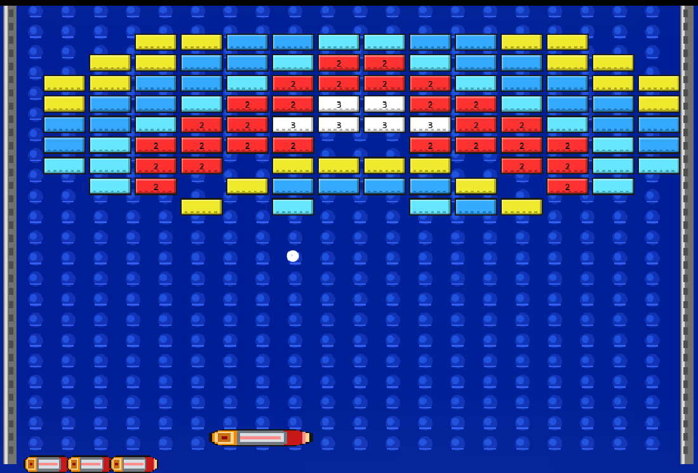

# Arkanoid: Revenge of the Dope

A browser-based Arkanoid tribute built as a lightweight, fully playable JavaScript game with arcade-faithful presentation, title video support, soundtrack playback, multiple stages, a Doh-style boss, and local project rules tracked in [`AGENTS.md`](./AGENTS.md).

SlimShady was an avid Arkanoid fan in the arcade days, and with modern AI tools in reach, he set himself a fun challenge: build a lightweight but fully working JavaScript Arkanoid tribute with multiple levels, a title screen, music, and gameplay that looked and felt as close to the original arcade experience as possible, all in about 15 minutes. That challenge turned into this project, and yes, we actually pulled it off.

## Play Online

Play the current GitHub Pages build here:

[Play Arkanoid: Revenge of the Dope](https://shadow2442.github.io/Arkanoid-Revenge-of-the-Dope/)

Version notes live in [CHANGELOG.md](./CHANGELOG.md).

## Preview

<table>
  <tr>
    <td align="center" valign="top">
      

        

        
      

    </td>
    <td align="center" valign="top">
      

        

        
      

    </td>
  </tr>
</table>

Click either preview to expand it, and click again to collapse it.

## Story

This tribute started as a fast creative sprint with a very specific goal: build a lightweight, fully playable JavaScript version of Arkanoid that captured as much of the original arcade look and feel as possible in one short AI-assisted session. The point was never to fake the experience with a graphics-heavy mock-up, but to ship a real browser game with proper controls, power-ups, stages, music, and game flow. Instead of stopping at a prototype, the project kept growing into a proper mini-arcade release with a title video, soundtrack support, gameplay polish, multiple stages, and a Doh-inspired finale.

## About The Original

The original *Arkanoid* was released by Taito in 1986 and became one of the defining brick-breaker arcade games. It took the older paddle-and-ball formula popularized by *Breakout* and gave it a stronger arcade identity through the Vaus paddle, power-ups, stage-based layouts, and a memorable sci-fi presentation. Its sequel, *Arkanoid: Revenge of Doh*, pushed that formula further with more elaborate stages, enemies, and boss-style encounters, which is the main inspiration behind this tribute.

## Highlights

- Playable browser build with arcade-style presentation
- Three handcrafted stages plus a Doh-inspired boss encounter
- Custom title video, soundtrack support, and retro UI effects
- Mouse and keyboard controls
- GitHub Pages deployment from the `website/` folder via Actions

## Power-Ups

- `E`: Expand Vaus for more forgiving returns
- `S`: Slow the ball down when the round gets too spicy
- `C`: Catch the ball and auto-release it after a short hold
- `L`: Enable laser fire, including left-click autofire support
- `D`: Trigger multiball chaos
- `P`: Add an extra life

## Controls

- `A` / `D` or `Left` / `Right`: move Vaus
- `Space` / `Enter`: launch ball and confirm menu choices
- `Left Click`: start game from title screen
- `Left Click` during laser power-up: fire lasers / hold for autofire
- `F`: fire lasers during laser power-up
- `P`: pause and resume
- `Esc`: open the return-to-title confirmation prompt

## Project Structure

- `website/`
  - Live web build files for the playable game
  - Includes `index.html`, `styles.css`, `game.js`, runtime assets, video, and soundtrack files
- `tools/`
  - Helper scripts for local workflow
- `AGENTS.md`
  - Project-specific working rules for Codex

## Run Locally

Open the live build from:

`website/index.html`

If you want a quick local launcher in Chrome, use:

`tools/open-local-in-chrome.ps1`

## Publishing Notes

- The playable GitHub Pages site is live at:
  - [https://shadow2442.github.io/Arkanoid-Revenge-of-the-Dope/](https://shadow2442.github.io/Arkanoid-Revenge-of-the-Dope/)
- The live build files are published from the `website/` folder through GitHub Actions
- Before future publishing changes, verify asset paths, audio/video references, and title-screen behavior

## Roadmap

- Tighten sprite art and enemy visuals even closer to the arcade original
- Add more stage layouts and alternate boss patterns
- Refine audio balancing between soundtrack, effects, and title presentation
- Add lightweight smoke checks for the web build on future pushes
- Package follow-up releases with version notes and gameplay highlights

## Current Runtime Assets

- Main game logic: `website/game.js`
- Main page: `website/index.html`
- Styles: `website/styles.css`
- Title video: `website/assets/video/title-screen.mp4`
- README preview GIF: `website/assets/readme/title-preview.gif`
- README gameplay screenshot: `website/assets/readme/gameplay-preview.png`
- Music: `website/soundtrack/`

## License

This project is released under [The Unlicense](./LICENSE).

That means anyone can use it, modify it, distribute it, remix it, and include it in other work with essentially no restrictions.

## Development Notes

- Keep the root folder minimal
- Keep public runtime files inside `website/`
- Avoid mixing internal project material into the public game area unless intentionally shipped
